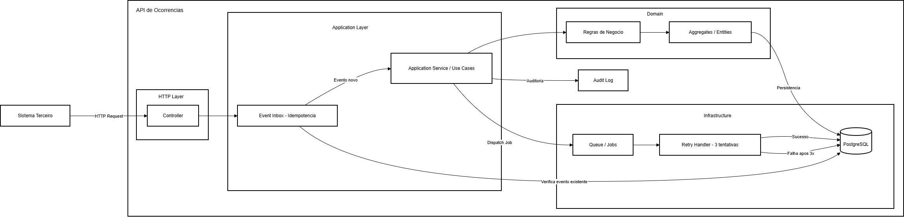

# Sistema de Ocorrências (Bombeiros)

Este projeto é uma solução para o gerenciamento de ocorrências, implementando uma arquitetura baseada em DDD (Domain-Driven Design) e Hexagonal Architecture.

---

## Como rodar backend e frontend

O projeto utiliza Docker para orquestrar todos os serviços (PHP 8.2, PostgreSQL, RabbitMQ, Nginx). O repositório contém dois sistemas distintos que se comunicam via mensageria.

### Pré-requisitos
- Docker
- Docker Compose

Para facilitar, temos scripts de automação que fazem todo o processo (Docker + Instalação + Migrations):

**Para rodar (Dois cliques):**
Execute o arquivo `setup.bat` na raiz do projeto.

**Para rodar os testes (Seguro):**
Execute o arquivo `test.bat`.

---

### Execução Manual

Caso prefira rodar manualmente:

1. Construir e subir os containers:
   ```bash
   docker-compose up -d --build
   ```

2. Configurar o **API Desafio** (Sistema Principal):
   Este comando instala dependências (PHP/Node), configura o ambiente e roda as migrações.
   ```bash
   docker exec -it bombeiros-api-desafio composer run setup
   ```

3. Configurar o **Sistema Terceiro** (Simulador de Ocorrências):
   Este comando prepara o simulador para envio de eventos.
   ```bash
   docker exec -it bombeiros-sistema-terceiro composer run setup
   ```

4. Acessar os Sistemas:

   - **Sistema Terceiro (Gerador)**: http://localhost:8000
     *Utilize este painel para simular o envio de novas ocorrências.*

   - **API Desafio (Gestão)**: http://localhost:8001
     *Dashboard principal para visualizar e gerenciar as ocorrências recebidas.*

   - **RabbitMQ Admin**: http://localhost:15672 (User: admin, Pass: admin)

---

## Desenho de arquitetura

O sistema segue os princípios de Clean Architecture e DDD, isolando as regras de negócio da infraestrutura.

- Domain: Contém Entidades, Value Objects e Interfaces (Ports). É o núcleo puro do sistema.
- Application: Contém os Casos de Uso (Use Cases) e DTOs. Orquestra o fluxo de dados.
- Infrastructure: Implementa os Adapters (Repositórios, RabbitMQ, Controllers, CLI).

**[📊 Ver diagrama Mermaid](docs/diagrama.mmd)**



---

## Estratégia de integração externa

A integração entre o **Sistema Terceiro** e a **API Desafio** é feita via **HTTP** com processamento assíncrono via **RabbitMQ**.

1. Recebimento de Eventos: O Sistema Terceiro envia uma requisição `POST` para a API Desafio.
2. Enfileiramento: A API valida a requisição e publica o evento na fila `occurrences` do RabbitMQ.
3. Processamento Assíncrono: Um Worker consome a fila e executa a regra de negócio (Criar, Iniciar, etc).

---

## Estratégia de idempotência

Para garantir que a mesma mensagem não gere efeitos colaterais duplicados:

1. Idempotency Key: Todo evento recebido possui uma chave única gerada na origem.
2. Event Inbox: Antes de processar, salvamos o evento na tabela `event_inboxes`. O banco de dados garante unicidade na chave.
3. Verificação de Estado: Se uma mensagem com a mesma chave chegar novamente:
   - Se já foi processada: O sistema ignora e confirma o recebimento (ack).
   - Se está pendente: O sistema aguarda ou descarta.

---

## Estratégia de concorrência

Para lidar com múltiplos workers processando mensagens simultaneamente:

1. Pessimistic Locking: Utilizamos `SELECT ... FOR UPDATE` ao buscar o evento no banco dentro de uma transação.
2. Atomicidade: O processamento do evento e a atualização do status ocorrem na mesma transação.
3. Race Conditions: O design impede que dois workers peguem o mesmo registro ao mesmo tempo.

---

## Pontos de falha e recuperação

O sistema foi desenhado para ser resiliente a falhas:

1. Tratamento de Exceções: Todo o processamento é protegido por blocos de tratamento de erro.
2. Mecanismo de Retry:
   - Falhas temporárias: A mensagem é devolvida à fila (nack) com incremento de tentativas.
   - Limite: Após 3 tentativas falhas, o evento é marcado como falha e removido da fila para evitar loops infinitos.
3. Log de Auditoria: Sucesso e falhas são registrados para rastreabilidade e reprocessamento.

---

## O que ficou de fora

Devido ao escopo e tempo do desafio:

1. Autenticação/Autorização Avançada (OAuth2/JWT).
2. Dead Letter Queues (DLQ), poderia implementar no Retry.
3. Instrumentação com métricas (Prometheus) e Tracing (OpenTelemetry).
4. Pipeline de CI/CD completa.

---

## Como o sistema poderia evoluir na corporação

1. Escalabilidade Horizontal: Aumentar o número de réplicas do worker conforme a demanda.
2. Microservices: Extrair módulos específicos (ex: Dispatch) para serviços independentes.
3. Event Sourcing: Migrar para um modelo onde cada mudança de estado é um evento imutável.
4. Dashboards em Tempo Real: Utilizar WebSockets para atualizações instantâneas no frontend.
